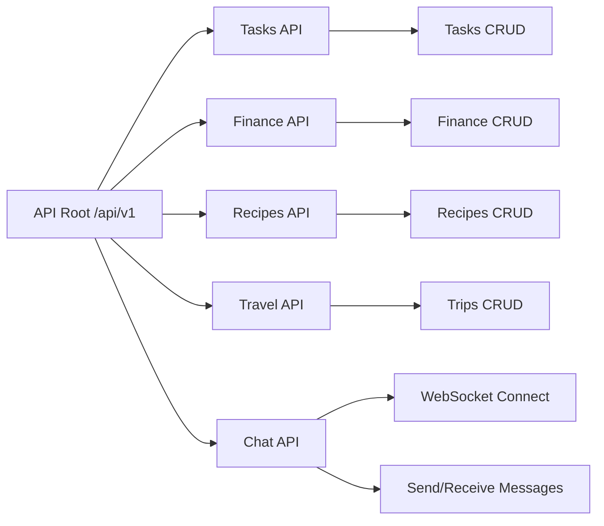

# 🚀 Productivity Hub — API Architecture Overview

## 📖 Notes

- **API Root:** All backend endpoints are grouped under the versioned namespace `/api/v1/`.
- **Tasks API:** Handles CRUD operations for user-created tasks.
- **Finance API:** Handles CRUD operations for user-created records.
- **Recipes API:** Handles CRUD operations for user-created recipes.
- **Travel API:** Handles CRUD operations for user-created trips.
- **Chat API:** Manages real-time messaging using WebSocket endpoints.

This overview defines the modular REST API surface to support clean, maintainable, and scalable communication between frontend and backend services.
