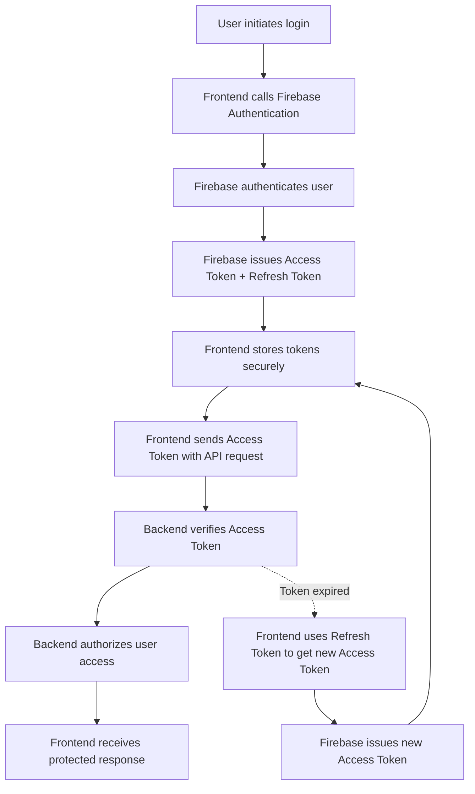

# 🚀 Productivity Hub — Authentication Flow Overview

## 📖 Notes

- **Login Flow:** User initiates login via the frontend, which authenticates with Firebase Authentication.
- **Token Issuance:** Firebase returns a short-lived Access Token and a long-lived Refresh Token.
- **Token Storage:** The frontend stores tokens securely.
- **Access Token Usage:** Sent with API requests via the `Authorization` header.
- **Token Validation:** Backend verifies Access Token validity using the Firebase Admin SDK.
- **Authorization:** Once verified, backend authorizes user access to protected endpoints.
- **Refresh Flow:** When the Access Token expires, the frontend uses the Refresh Token to obtain a new Access Token from Firebase without requiring user interaction.

This overview defines the modular authentication flow designed to support secure, token-based session management across frontend and backend.
