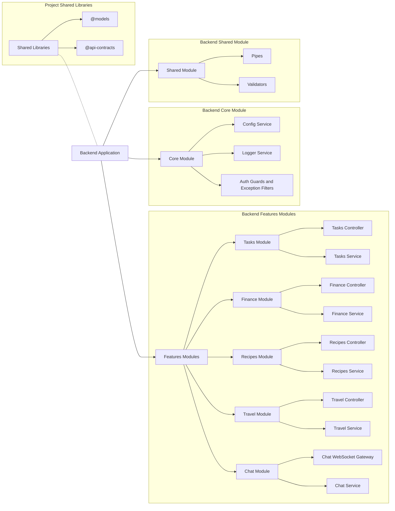

# 🚀 Productivity Hub — Backend Architecture Overview

## 📖 Notes

- **Project Shared Libraries:** Global TypeScript libraries reused across frontend and backend:
  - `@models`: Core business entities and shared types
  - `@api-contracts`: DTOs and request/response schemas for API communication
- **Backend Application:** Root NestJS server instance orchestrating all modules.
- **Shared Module:** Common utilities (e.g., pipes, validators) accessible across features.
- **Core Module:** Global singleton providers (e.g., config, logger, guards).
- **Feature Modules:** Domain-specific NestJS modules (tasks, finance, recipes, travel, chat) following Controller ➔ Service clean separation.
- **Chat Module:** Uses WebSocket Gateway to enable real-time messaging services.

This overview defines the modular backend architecture optimized for scalability, maintainability, and clean separation of concerns.
