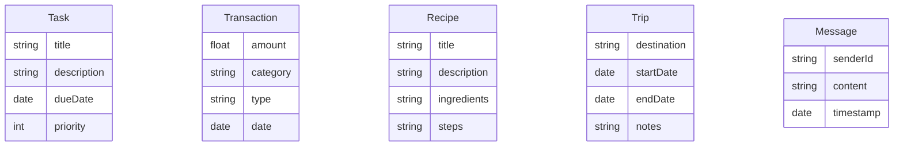

# 🚀 Productivity Hub — Database Architecture Overview

## 📖 Notes

- **Task:** Stores personal task records with support for priority levels and deadlines.
- **Transaction:** Captures categorized financial entries for income and expenses, with timestamps.
- **Recipe:** Defines structured entries for the Recipe Book, including ingredients and preparation steps.
- **Trip:** Records travel details like destinations, dates, and optional notes for itinerary planning.
- **Message:** Represents chat messages with sender references and timestamps for real-time delivery.

This overview defines the modular database foundation designed to support reliable persistence and future data model expansion.
