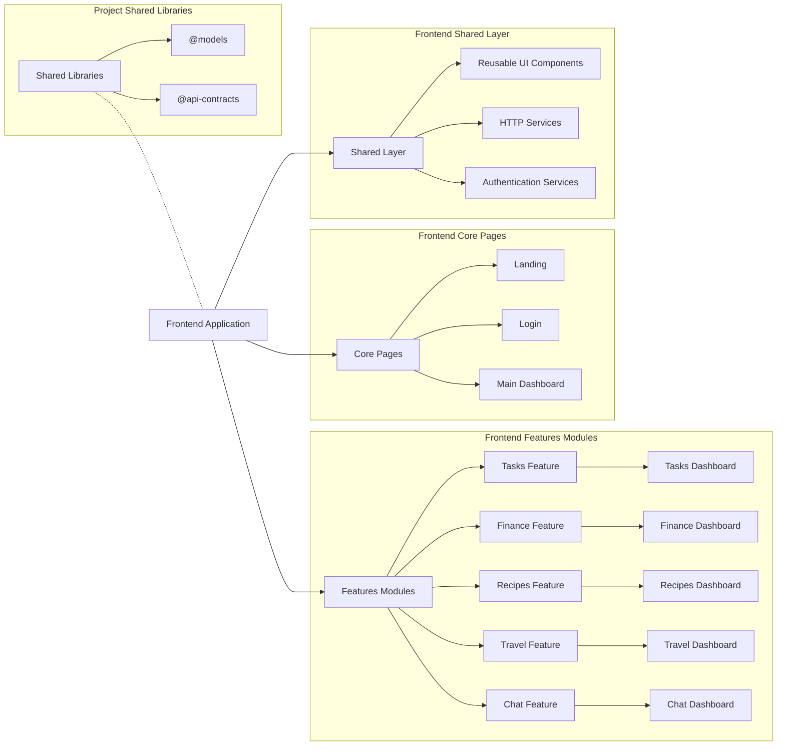

# 🚀 Productivity Hub — Frontend Architecture Overview

## 📖 Notes

- **Project Shared Libraries:** Global TypeScript libraries reused across frontend and backend:
  - `@models`: Core business entities and shared types
  - `@api-contracts`: DTOs and request/response schemas for API communication
- **Frontend Application:** Root Angular app managing layout, routing, and module integration.
- **Shared Layer:** Core services and reusable UI components available across all pages and features.
- **Core Pages:** Application entry points and key shell views (e.g., landing, login, dashboard).
- **Feature Modules:** Standalone, lazy-loaded modules for individual app areas (e.g., tasks, finance, recipes, travel, chat).

This overview defines the frontend structure to support scalable module development, shared logic, and maintainable UI composition.
