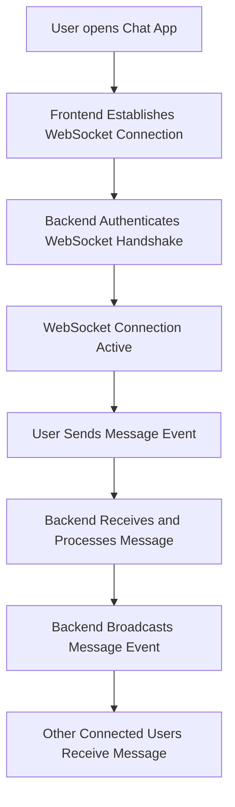

# 🚀 Productivity Hub — Realtime Communication Flow Overview

## 📖 Notes

- **WebSocket Connection:** A persistent, bidirectional channel is established between frontend and backend for live data exchange.
- **Authentication:** The backend authenticates the WebSocket handshake using the client’s access token to ensure secure communication.
- **Message Flow:**
  - `send_message`: Triggered when a user sends a message from the frontend.
  - `receive_message`: Broadcasted by the backend to deliver messages to all connected recipients.
- **Real-time Updates:** Messages are delivered instantly to other users without page refresh or polling mechanisms.

This overview defines the scalable and event-driven architecture powering real-time collaboration in the Chat App module.
