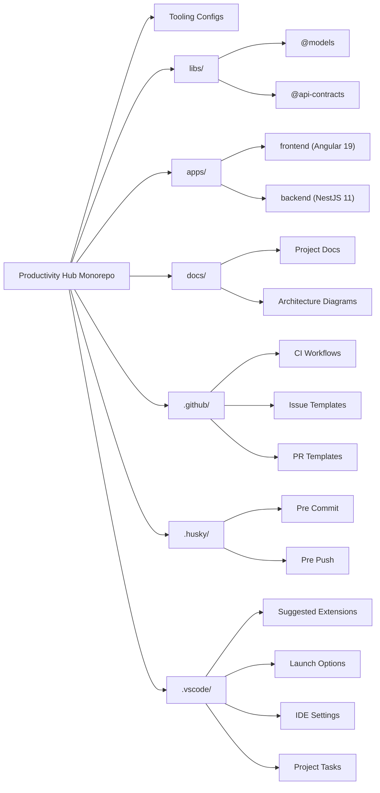

# 🚀 Productivity Hub — Repository Architecture Overview

## 📖 Notes

- **Tooling Configs**: Top-level configuration files used by Bun, ESLint (Flat), Prettier, Husky and lint-staged.
- **libs/**: Global TypeScript libraries reused across frontend and backend:
  - `@models`: Core business entities and shared types
  - `@api-contracts`: DTOs and request/response schemas for API communication
- **apps/**: Contains all deployable applications. `frontend/` is an Angular 19 SPA; `backend/` is a NestJS 11 REST API.
- **docs/**: Project developer documentation and architecture diagrams, including system design, scripts, tooling, and security.
- **.github/**: GitHub workflows and community files:
  - `actions/`: CI pipelines (build, test, lint, scan)
  - `issue templates/`: Standardized GitHub issue creation
  - `pull request templates/`: Templates for structured PR descriptions
- **.husky/**: Git hooks for enforcing lint, format, and test checks during development:
  - `pre-commit`: Runs Prettier and ESLint via lint-staged
  - `pre-push`: Verifies formatting, lint, and tests before pushing code
- **.vscode/**: Recommended workspace settings for consistency across contributors:
  - `settings.json`: Format on save, ESLint/Prettier integration
  - `extensions.json`: Suggested VS Code extensions for contributors
  - `tasks.json`, `launch.json`: Useful for running, debugging, and managing tasks

This overview defines the top-level monorepo structure used to manage features, tooling, quality automation, and documentation in a clean and scalable way.
